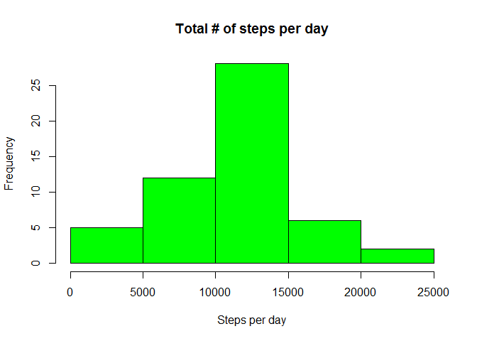
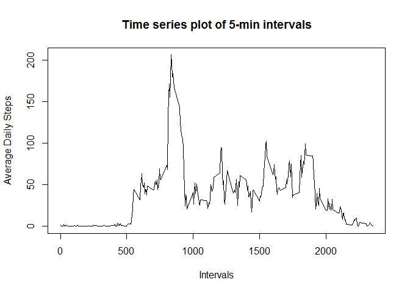
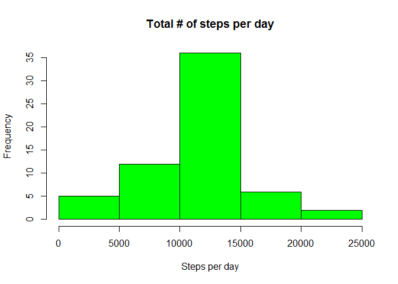
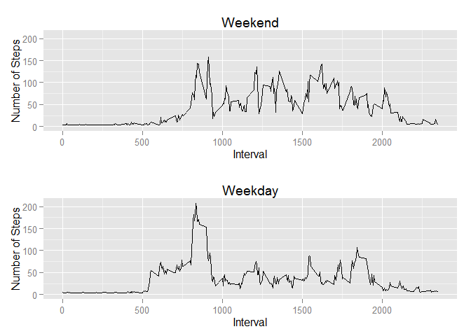

# Reproducible Research: Peer Assessment 1


## Loading and preprocessing the data

Unzip and load the activity.csv file.

```r
unzip(zipfile="./activity.zip")

activityData <- read.csv('activity.csv', 
                         head = TRUE, 
                         stringsAsFactors = FALSE)
```

Create date data type and dataset without NA's.

```r
activityData$date <- as.Date(activityData$date)
activityDateLessNA=na.omit(activityData)

library(ggplot2)
```


## What is mean total number of steps taken per day?

This is a histogram of the total number of steps taken each day.

```r
#total number of steps each day
dailySteps <-
    aggregate(formula = steps~date, data = activityData,
              FUN = sum, na.rm=TRUE)
hist(dailySteps$steps, col = "green",
     xlab = 'Steps per day',
     main='Total # of steps per day')
```

 

This calculates the mean and median total number of steps taken per day.

```r
#mean
meanDailySteps <- mean(dailySteps$steps)

#median
medianDailySteps <- median(dailySteps$steps)

#sum
sumDailySteps <- sum(dailySteps$steps)
```
### The mean and median number of steps taken each day
The mean total number of steps taken per day is 10766.19
The median total number of steps taken per day is 10765

## What is the average daily activity pattern?

This is a time series plot of the 5-minute interval (x-axis) and the average number of steps taken, averaged across all days (y-axis)

```r
averageDailyActivity=tapply(activityDateLessNA$steps,
                            activityDateLessNA$interval,
                            mean)
daysWithDailyActivity = length(averageDailyActivity)
plot(names(averageDailyActivity),
     averageDailyActivity,
     xlab = 'Intervals',
     ylab = 'Average Daily Steps',
     type='l', 
     main='Time series plot of 5-min intervals')
```

 

### The 5-minute interval that, on average, contains the maximum number of steps
The 5-minute interval, on average across all the days in the dataset, contains the maximum number of steps is 835

## Imputing missing values


```r
# Total step observation - observations wth NS'a removed
totalnas <- dim(activityData)[1] - dim(activityDateLessNA)[1]
```

The total number of missing values in the dataset is 2304

Fill in all of the missing values in the dataset. Using the "mice" package to impute the missing steps. The algorithm imputes an incomplete column by generating 'plausible' synthetic values given other columns in the data. Each incomplete column must act as a target column, and has its own specific set of predictors. (from mice documentation)

```r
library(mice)
```

```
## Loading required package: Rcpp
## Loading required package: lattice
## mice 2.22 2014-06-10
```

```r
steps <- activityData$steps
intervals <- activityData$interval
combined <- data.frame(steps,intervals)
imputedData <- mice(combined, print = FALSE, method = "norm.predict")
```

This is a new dataset that is equal to the original dataset but with the missing data filled in.

```r
activityDataAdjusted <- cbind((complete(imputedData)),
                              date=activityData$date)
```
This is a histogram of the total number of steps taken each day and calculate and report the mean and median total number of steps taken per day after missing values were imputed.

```r
#total number of steps each day
adjustedDailySteps <-
    aggregate(formula = steps~date, data = activityDataAdjusted,
              FUN = sum, na.rm=TRUE)

hist(adjustedDailySteps$steps, col = "green",
     xlab = 'Steps per day',
     main='Total # of steps per day')
```

 

```r
#mean
adjustedMeanDailySteps <- mean(adjustedDailySteps$steps)

#median
adjustedMedianDailySteps <- median(adjustedDailySteps$steps)

#sum
adjustedSumDailySteps <- sum(adjustedDailySteps$steps)
```

The original mean total number of steps taken per day is 10766.19
The imputed mean total number of steps taken per day is 10766.18

The original median total number of steps taken per day is 10765
The imputed median total number of steps taken per day is 10766.1

The original total number of steps taken is 570608
The imputed total number of steps taken is 656736.8

## Are there differences in activity patterns between weekdays and weekends?

This is a new factor variable in the dataset with two levels -- "weekday" and "weekend" indicating whether a given date is a weekday or weekend day.

```r
activityDataAdjusted$dayType <- sapply(weekdays(activityDataAdjusted$date), switch, 
                                "Saturday"  = "Weekend", 
                                "Sunday"    = "Weekend", 
                                "Monday"    = "Weekday", 
                                "Tuesday"   = "Weekday",
                                "Wednesday" = "Weekday",
                                "Thursday"  = "Weekday",
                                "Friday"    = "Weekday")

activityDataAdjusted$dayType <- as.factor(activityDataAdjusted$dayType)

### Create Weekends Data Set
weekends <- sample(activityDataAdjusted[activityDataAdjusted$dayType=="Weekend",])

### Create Weekdays Data Set
weekdays <- sample(activityDataAdjusted[activityDataAdjusted$dayType=="Weekday",])

weekendInterval <- aggregate(weekends$steps, by=list(weekends$interval), FUN=mean)
colnames(weekendInterval) <- c("intervals", "steps")

weekdayInterval <- aggregate(weekdays$steps, by=list(weekdays$interval), FUN=mean)
colnames(weekdayInterval) <- c("intervals", "steps")
```

To create a panel plot with ggplot2, I am using a function from webpage http://www.cookbook-r.com/Graphs/Multiple_graphs_on_one_page_(ggplot2)/

```r
# Using ggplot2 multi-panel solution
# start from webpage 
# http://www.cookbook-r.com/Graphs/Multiple_graphs_on_one_page_(ggplot2)/
#
# Multiple plot function
#
# ggplot objects can be passed in ..., or to plotlist (as a list of ggplot objects)
# - cols:   Number of columns in layout
# - layout: A matrix specifying the layout. If present, 'cols' is ignored.
#
# If the layout is something like matrix(c(1,2,3,3), nrow=2, byrow=TRUE),
# then plot 1 will go in the upper left, 2 will go in the upper right, and
# 3 will go all the way across the bottom.
#
multiplot <- function(..., plotlist=NULL, file, cols=1, layout=NULL) {
    library(grid)
    
    # Make a list from the ... arguments and plotlist
    plots <- c(list(...), plotlist)
    
    numPlots = length(plots)
    
    # If layout is NULL, then use 'cols' to determine layout
    if (is.null(layout)) {
        # Make the panel
        # ncol: Number of columns of plots
        # nrow: Number of rows needed, calculated from # of cols
        layout <- matrix(seq(1, cols * ceiling(numPlots/cols)),
                         ncol = cols, nrow = ceiling(numPlots/cols))
    }
    
    if (numPlots==1) {
        print(plots[[1]])
        
    } else {
        # Set up the page
        grid.newpage()
        pushViewport(viewport(layout = grid.layout(nrow(layout), ncol(layout))))
        
        # Make each plot, in the correct location
        for (i in 1:numPlots) {
            # Get the i,j matrix positions of the regions that contain this subplot
            matchidx <- as.data.frame(which(layout == i, arr.ind = TRUE))
            
            print(plots[[i]], vp = viewport(layout.pos.row = matchidx$row,
                                            layout.pos.col = matchidx$col))
        }
    }
}

# end from webpage
# http://www.cookbook-r.com/Graphs/Multiple_graphs_on_one_page_(ggplot2)/
#
```

Here is a panel plot containing a time series plot (i.e. type = "l") of the 5-minute interval (x-axis) and the average number of steps taken, averaged across all weekday days or weekend days (y-axis).


```r
p1 <- ggplot(weekendInterval) + geom_line(aes(x=intervals, y=steps)) +
    scale_x_continuous(breaks=seq(from=min(weekendInterval$intervals), 
                                  to=max(weekendInterval$intervals), by=500)) + 
    scale_y_continuous(limits=c(0,max(weekdayInterval$steps))) +     
    labs(x = "Interval",
         y = "Number of Steps",
         title = "Weekend",col="")         

p2 <- ggplot(weekdayInterval) + geom_line(aes(x=intervals, y=steps)) +
    scale_x_continuous(breaks=seq(from=min(weekdayInterval$intervals), 
                                  to=max(weekdayInterval$intervals), by=500)) + 
    scale_y_continuous(limits=c(0,max(weekdayInterval$steps))) +  
    
    labs(x = "Interval",
         y = "Number of Steps",
         title = "Weekday",col="")         

multiplot(p1, p2, cols=1)
```

 


